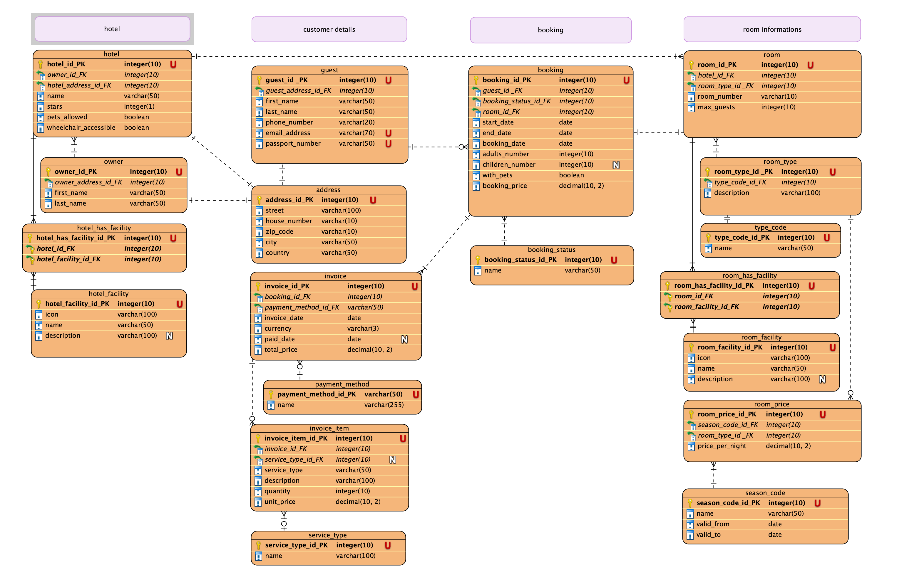

# Hotel Data Analysis & Database Design

University group project focused on the design and implementation of a relational database for a hotel reservation system.

The project was completed as part of the module **Datenbasierte Unternehmensanwendungen**.

## Academic Result

- **Group Project Grade:** 6.0

## Project Overview

The objective of this project was to design and implement a structured hotel reservation database.

The project covers areas such as:

- Hotels and hotel owners
- Rooms and room types
- Guests and addresses
- Bookings and booking statuses
- Seasonal room pricing
- Invoices and payment methods
- Hotel and room facilities

## Technologies & Skills

- SQL
- SQLite
- Deepnote
- Relational Database Design
- Entity-Relationship Diagrams (ERD)
- Primary and Foreign Keys
- Database Normalisation
- SQL Joins
- Subqueries
- Data Analysis
- Database Testing

## My Contribution

In addition to my role as Project Manager & Scrum Master, I actively contributed to the technical development of the project.

My contributions included:

- Writing and testing SQL queries
- Working with joins, subqueries and database views
- Contributing to the relational database design and normalisation
- Supporting the development and testing of the SQLite database
- Contributing to the project structure and Deepnote setup
- Creating and maintaining parts of the project documentation and templates
- Coordinating tasks, responsibilities and deadlines within the team
- Monitoring project progress and maintaining the project planning

## Entity-Relationship Model

The following ER model shows the structure and relationships of the database:



## Repository Structure

```text
hotel-data-analysis/
│
├── notebooks/
│   ├── 01_Project_presentation.ipynb
│   ├── 02_Projectmanagement.ipynb
│   ├── 03_Documentation.ipynb
│   ├── 04_ERD.ipynb
│   └── 05_Code.ipynb
│
├── database/
│   └── hotel_database.db
│
├── images/
│   ├── ER_Model.png
│   ├── Hotel.png
│   ├── Booking.png
│   ├── Customer_Details.png
│   └── Room_Information.png
│
└── README.md
